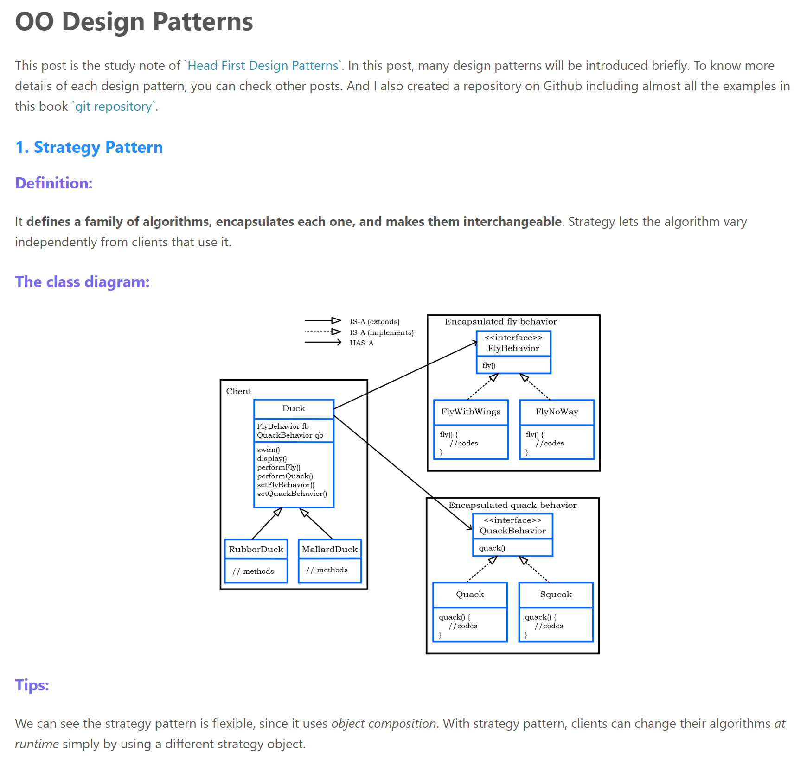

# Examples in Head First Design Patterns

**Implement almost all examples in book `Head First Design Patterns` using Java.**

#
If you are also interested in OO Design Patterns, I strongly recommend `Head First Design Patterns` to you. I have written some study notes of this book in my blog. In the notes, the design patterns were introduced on three aspects (definition, class diagram, some tips) like this.

  

Here is the link to my blog ([LINK](https://tongshi049.github.io/tags/Design-Pattern/)).

